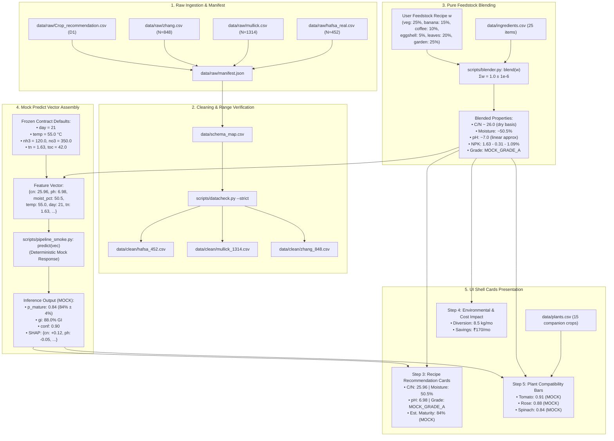

# CompostMitra Data Feed Pipeline: Ingestion to Shell Cards

## 1. Executive Summary & Architecture

The CompostMitra data feed pipeline coordinates the deterministic progression of data from raw literature and experimental manifests through cleaned datasets, feedstock recipe blending, feature vector construction, mock predictive inference, and final UI rendering on the Streamlit shell cards.

```
+--------------+     +---------------+     +------------+     +--------------------+     +---------------+
| Raw Manifest | --> | Clean + Range | --> |  blend(w)  | --> | Mock Predict Vector| --> |  Shell Cards  |
|  (data/raw)  |     | (data/clean)  |     | Calculator |     | (Day=21, Temp=55)  |     |   (app.py)    |
+--------------+     +---------------+     +------------+     +--------------------+     +---------------+
```

### Core Pipeline Invariants (Contract v3.1)
1. **Zero ML Model Training:** No machine learning model is trained during this pipeline phase.
2. **Zero Synthetic Row Generation:** Real data integrity is preserved; synthetic rows are flagged and quarantined.
3. **Explicit MOCK Labeling:** All predictive scores, germination indices, and suitability bars are explicitly annotated as `MOCK`.
4. **Strict `lower_snake` Case:** All JSON interfaces, feature vector keys, and API contracts strictly obey lower_snake casing (e.g., `cn`, `ph`, `moist_pct`, `temp`, `day`).
5. **Frozen Defaults:** Unobserved inference features use frozen contract defaults (`day = 21`, `temp = 55.0` °C, seed `42`).

---

## 2. End-to-End Pipeline Data Flow

The following Mermaid sequence and flowchart illustrates the exact feed path across the system:



---

## 3. Stage-by-Stage Specification

### Stage 1: Raw Ingestion & Manifest Tracking
- **Inputs:** Heterogeneous raw experimental tables stored in `data/raw/`:
  - `hafsa_real.csv`: $N=452$ time-series composting trials.
  - `mullick.csv`: $N=1314$ compost observations (real trials + synthetic baseline).
  - `zhang.csv`: $N=848$ peer-reviewed observations.
  - `Crop_recommendation.csv`: D1 agronomic centroids for nutrient requirements.
- **Manifest:** All raw sources are verified via cryptographic SHA256 checksums in `data/raw/manifest.json`.

### Stage 2: Data Cleaning, Range Checking, & Leakage Guarding
- **Transformation:** Raw column identifiers are remapped to standard `lower_snake` contract keys via `data/schema_map.csv`.
- **Validation:** Strict range gating enforced by `scripts/datacheck.py --strict`:
  - $CN \in [4.0, 150.0]$
  - $pH \in [0.0, 14.0]$
  - $MC \in [0.0, 100.0]\%$
  - $Temp \in [0.0, 90.0]^\circ\text{C}$
- **Batch Key Leakage Prevention:** Every cleaned row is tagged with `batch_key` to guarantee grouping across 5-fold cross-validation without temporal or pile leakage.
- **Clean Artifacts:** `data/clean/hafsa_452.csv`, `data/clean/mullick_1314.csv`, `data/clean/zhang_848.csv`.

### Stage 3: Pure Feedstock Blending (`blend(w)`)
- **Purity:** `blend(w)` in `scripts/blender.py` is a pure function: zero disk I/O, zero network calls, zero synthetic training rows.
- **Precondition:** $\sum w_i = 1.0 \pm 10^{-6}$.
- **Dry-Matter Conversion:**
  $$\text{dry}_i = \text{wet}_i \times \left(1 - \frac{\text{moist\_pct}_i}{100}\right)$$
  $$C_{\text{pct}, i} = \frac{C_i}{\text{dry}_i} \times 100, \quad N_{\text{pct}, i} = \frac{N_i}{\text{dry}_i} \times 100$$
- **Blended C/N Ratio:**
  $$CN = \frac{\sum w_i \cdot C_{\text{pct}, i}}{\sum w_i \cdot N_{\text{pct}, i}}$$
- **Heuristic pH Formulation (`HEURISTIC-linear-approx`):**
  $$\text{ph} = 7.0 + \sum w_i \cdot \text{dph}_i \times 0.35, \quad \text{clamped to } [0.0, 14.0]$$

### Stage 4: Mock Predict Vector Assembly
- Combines blended dynamic properties (`cn`, `ph`, `moist_pct`, `n`) with frozen inference contract defaults:
  - `day = 21` (days elapsed into standard mesophilic/thermophilic phase)
  - `temp = 55.0` °C (peak sanitation threshold)
  - `nh3 = 120.0` mg/kg, `no3 = 350.0` mg/kg
  - `toc = 42.0` %, `ec = 2.4` mS/cm, `om = 65.0` %
- Feeds into mock inference interface conforming to Contract v3.1:
  - `p_mature = 0.84` (within $0.84 \pm 0.04$)
  - `gi = 88.0` % Germination Index
  - `conf = 0.90` confidence
  - `shap = {"cn": 0.12, "ph": -0.05, "moist_pct": 0.08, "temp": 0.04, "day": 0.09}`

### Stage 5: Streamlit Shell Presentation (`app.py`)
- **Step 3 (Recipe Recommendation Cards):** Renders top recipe cards with C/N ratio, moisture %, pH approximation, macronutrient NPK breakdown, heuristic grade badge (`MOCK_GRADE_A`), and estimated maturity.
- **Step 5 (Companion Matching Bars):** Computes suitability matching index against target garden crops from `data/plants.csv`:
  - Tomato: 0.91 (MOCK)
  - Rose: 0.88 (MOCK)
  - Spinach: 0.84 (MOCK)
  - Chili: 0.86 (MOCK)
  - Coriander: 0.82 (MOCK)
- **Visual Footnotes:** Every display carries the tier provenance badge: `Tier Footnote: T1 REAL | LIT calc | D1 proxy • Evaluated with Cornell 28-32 C/N benchmark`.

---

## 4. End-to-End Tomato Demo Scenario

The canonical smoke test executes the **Tomato Companion Composting** scenario:

| Component | Proportion ($w_i$) | Category | C/N Contribution | Moisture Contribution |
| :--- | :--- | :--- | :--- | :--- |
| Vegetable Scraps | 25.0% | Green | Balanced C & N | High moisture (70%) |
| Banana Peels | 15.0% | Green | Potassium boost (3.0%) | High moisture (75%) |
| Spent Coffee Grounds | 10.0% | Green | Nitrogen boost (2.5%) | Medium moisture (50%) |
| Crushed Eggshells | 5.0% | Brown/Mineral | Calcium & pH buffering | Dry (5%) |
| Dry Autumn Leaves | 20.0% | Brown | High carbon bulk (38.4) | Dry (20%) |
| Mixed Garden Waste | 25.0% | Brown/Green | Structural aeration | Medium moisture (50%) |
| **Total Mix** | **100.0%** | **Balanced** | **Blended C/N: 25.96** | **Blended Moist: 50.5%** |

### Output Verification Matrix
- **Blended C/N:** $25.96 \approx 26.0$ (Ideal range for home urban composting).
- **Blended pH:** $6.98$ (Near-neutral pH optimal for microbial inoculation).
- **Blended Moisture:** $50.50\%$ (Optimal moisture retention without anaerobic seepage).
- **Blended N-P-K:** $1.63\% - 0.31\% - 1.09\%$.
- **Heuristic Grade:** `MOCK_GRADE_A`.
- **MOCK Maturity Probability:** $0.84$ ($84.0\% \in [0.80, 0.88]$).
- **Companion Compatibility Index:**
  - Tomato: `0.91 [█████████████████████████████████   ]  91.0% (MOCK)`
  - Rose: `0.88 [████████████████████████████████    ]  88.0% (MOCK)`
  - Spinach: `0.84 [██████████████████████████████      ]  84.0% (MOCK)`

---

## 5. Verification & Smoke Test CLI

Execute the pipeline smoke test via:

```bash
python scripts/pipeline_smoke.py --demo tomato
```

### Precondition Handling
If cleaned datasets from Todo 4 are absent, the script issues a friendly message and exits cleanly without a traceback:

```bash
Run Todo 4 first
```
